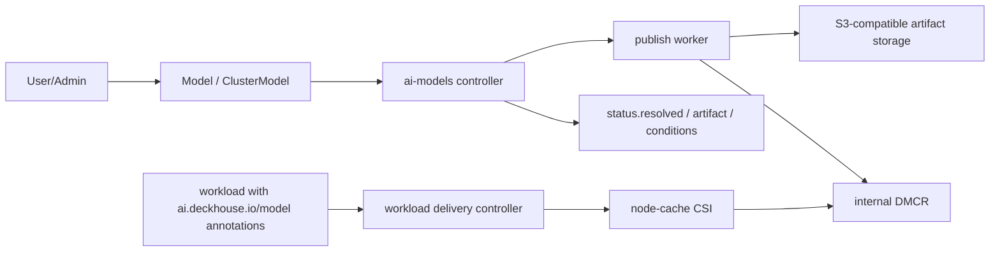

`ai-models` is the DKP module for a unified AI/ML model catalog. The module
accepts a model from a remote source or an upload session, publishes it as a
controller-owned OCI artifact in the internal `DMCR`, and prepares a stable
workload delivery contract.

## What The Module Does

- Provides `Model` for namespace-scoped models and `ClusterModel` for
  cluster-scoped shared models.
- Publishes each model as a canonical OCI `ModelPack` artifact in the internal
  `DMCR`; users do not configure `DMCR` directly.
- Supports `HuggingFace` sources, `Ollama` registry GGUF sources, and upload
  sessions.
- Calculates public metadata: format, family, architecture, normalized
  endpoint types, features, and provider evidence.
- Delivers published models into workloads through the
  `ai.deckhouse.io/model` / `ai.deckhouse.io/clustermodel` annotation contract
  and stable `/data/modelcache/models/<model-name>` paths.
- Can use an SDS-backed managed node-local cache for SharedDirect delivery.

## Architecture

## Components

| Component | Placement | Responsibility |
| --- | --- | --- |
| `ai-models-controller` | `d8-ai-models` | Reconciles `Model` / `ClusterModel`, publication, upload sessions, workload delivery, and metrics. |
| `publish-worker` | one-shot Pod | Reads source bytes and publishes an OCI artifact into the internal `DMCR`. |
| `upload-session` / upload gateway | controller-owned runtime | Issues upload URLs, accepts `curl -T` direct upload plus multipart clients, and moves uploaded bytes into publication. |
| `DMCR` | `d8-ai-models` | Internal registry-backed publication backend. It is not a public API. |
| `node-cache-runtime` | selected cache nodes | Prefetch, maintenance, and CSI mount for SharedDirect node-local cache. |

## Preview Limitations

- `Ollama` publication uses the registry manifest/config/blob path. Public HTML
  pages and a local Ollama daemon are not controller-runtime dependencies.
- `Diffusers` layout and metadata are supported as artifact/profile contract;
  concrete serving runtime selection belongs to future `ai-inference`.
- `nodeCache.enabled=true` requires `sds-node-configurator` and
  `sds-local-volume`.

## Documentation

- [Admin Guide](admin_guide.html) — module enablement, artifact storage,
  node-cache/SDS, RBAC, monitoring, and operations.
- [User Guide](user_guide.html) — `Model` / `ClusterModel`, upload, statuses,
  and workload model delivery.
- [Configuration](configuration.html) — full `ModuleConfig` reference.
- [CRD](cr.html) — `Model` and `ClusterModel` schema.
- [Examples](examples.html) — ready-to-use YAML snippets.
- [FAQ](faq.html) — common questions and diagnostics.
