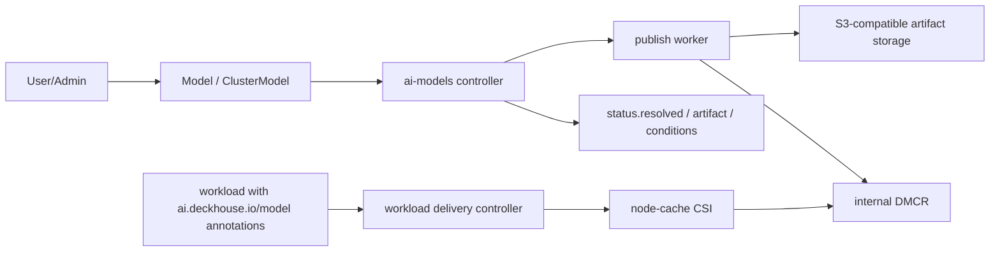

`ai-models` — модуль DKP для единого каталога AI/ML-моделей. Модуль принимает
модель из внешнего источника или upload-сессии, публикует её в
controller-owned OCI artifact во внутренний `DMCR` и подготавливает стабильный
контракт доставки модели в workload.

## Что делает модуль

- Вводит два пользовательских ресурса каталога:
  `Model` для namespace-scoped моделей и `ClusterModel` для общих
  cluster-scoped моделей.
- Публикует модель в канонический OCI `ModelPack` artifact во внутреннем
  `DMCR`; пользователи не настраивают `DMCR` напрямую.
- Поддерживает источники `HuggingFace`, `Ollama` registry GGUF и
  upload-сессии.
- Рассчитывает публичную metadata: формат, семейство, архитектуру,
  normalized endpoint types, features и provider evidence.
- Доставляет опубликованные модели в workload через annotation-based contract:
  `ai.deckhouse.io/model` / `ai.deckhouse.io/clustermodel` и стабильные пути
  `/data/modelcache/models/<model-name>`.
- Может использовать managed node-local cache поверх SDS для SharedDirect
  delivery.

## Архитектура

## Компоненты

| Компонент | Где работает | Роль |
| --- | --- | --- |
| `ai-models-controller` | `d8-ai-models` | Reconcile `Model` / `ClusterModel`, publication, upload sessions, workload delivery, metrics. |
| `publish-worker` | one-shot Pod | Скачивает/читает source bytes и публикует OCI artifact во внутренний `DMCR`. |
| `upload-session` / upload gateway | controller-owned runtime | Выдаёт upload URL, принимает прямой `curl -T` upload и multipart-клиентов, переводит upload в publication path. |
| `DMCR` | `d8-ai-models` | Внутренний registry-backed publication backend. Не является публичным API. |
| `node-cache-runtime` | selected cache nodes | Prefetch, maintenance и CSI mount для SharedDirect node-local cache. |

## Ограничения Preview

- `Ollama` publication использует registry manifest/config/blob path. Public
  HTML-страницы и локальный Ollama daemon не являются зависимостями
  controller-runtime.
- `Diffusers` layout и metadata поддерживаются как artifact/profile contract;
  конкретный serving runtime выбирает будущий `ai-inference`.
- `nodeCache.enabled=true` требует `sds-node-configurator` и
  `sds-local-volume`.

## Документация

- [Руководство администратора](admin_guide.html) — включение модуля,
  artifact storage, node-cache/SDS, RBAC, monitoring и эксплуатация.
- [Руководство пользователя](user_guide.html) — создание `Model` /
  `ClusterModel`, upload, статусы и подключение моделей в workload.
- [Конфигурация](configuration.html) — полный справочник `ModuleConfig`.
- [CRD](cr.html) — схема `Model` и `ClusterModel`.
- [Примеры](examples.html) — готовые YAML snippets.
- [FAQ](faq.html) — типовые вопросы и диагностика.
